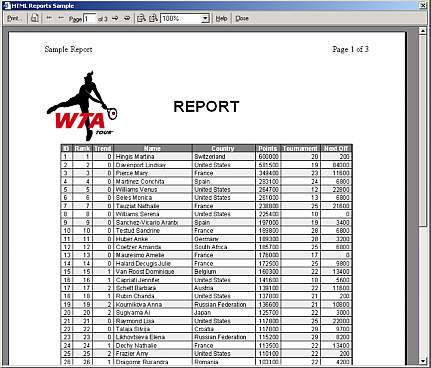



## HTML Reports \(Updated\)

### Description

Everyone knows, that VB's reports can only make static reports... And what can we do to make report from dynamically selected data? Here is the answer: we only need to use HTML Reports - easy and powerful solution for creating HTML-based reports. This is the initial version, I think, that some improvements can be implemented in the future... Please leave your suggestions, comments AND VOTES :-) Thx.
 
### More Info
 

             |
---                |---
**Submitted On**   |2003-09-16 14:59:22
**By**             |[Tomasz Puwalski](https://github.com/Planet-Source-Code/PSCIndex/blob/master/ByAuthor/tomasz-puwalski.md)
**Level**          |Intermediate
**User Rating**    |4.9 (166 globes from 34 users)
**Compatibility**  |VB 6\.0
**Category**       |[Databases/ Data Access/ DAO/ ADO](https://github.com/Planet-Source-Code/PSCIndex/blob/master/ByCategory/databases-data-access-dao-ado__1-6.md)
**World**          |[Visual Basic](https://github.com/Planet-Source-Code/PSCIndex/blob/master/ByWorld/visual-basic.md)
**Archive File**   |[HTML\_Repor1646699172003\.zip](https://github.com/Planet-Source-Code/tomasz-puwalski-html-reports-updated__1-48537/archive/master.zip)

